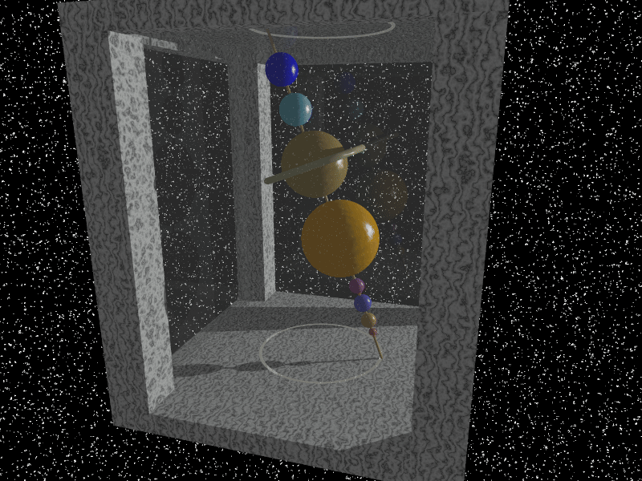

# Stellar

A raytraced Computer Graphics animation built in [POV-Ray](https://www.povray.org/) with GitHub Actions support

# Project Template

This project is meant to serve as a template for automating POV-Ray build processes via local installations of POV-Ray, Docker, or GitHub Actions.

## Step 1 - Configuration - `scripts/build.conf`

- Change the `OUTPUT_FILE_NAME` variable to set the output file name
- Customize the output directory with the `OUTPUT_DIR` variable.
- Adjust the output resolution using `OUTPUT_W` and `OUTPUT_H`
- If utilizing the Docker option in Step 2:
  - Choose whether or not to build the provided `Dockerfile` by setting the `BUILD_IMAGE` variable
  - Optionally set the name of the docker image to be built with `IMAGE_NAME`

## Step 2 (Option A) - Building Locally with Docker

- Install Docker
- `chmod +x scripts/build.sh`
- `scripts/build.sh`
- Output files will be placed in the directory specified by `OUTPUT_DIR` in `scripts/build.conf`.

## Step 2 (Option B) - Building Locally with POV-Ray

- Optionally build and run a VSCode or GitHub Codespace container using the provided `devcontainer.json`
- `chmod +x scripts/gif.sh scripts/png.sh`
- `scripts/gif.sh` to generate a `.gif` from an `.ini` file
- `scripts/png.sh` to generate a `.png` from a `.pov` file
- Output files will be placed in the directory specified by `OUTPUT_DIR` in `scripts/build.conf`.

## Step 2 (Option C) - Building in the Cloud with GitHub Actions

- Activate Actions on your GitHub Repository `Actions` page
- The build action will run when any `.pov` or `.ini` file is modified in a commit
- The build action can manually be triggered via `Actions -> Build POV-Ray Image -> Run workflow`
